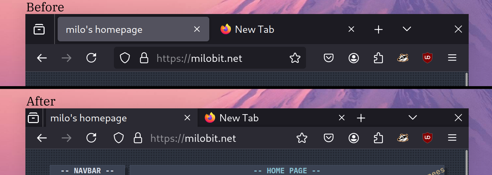

custom css for firefox that reduces the height of the upper bar so that you can fit more website on-screen.

yes, it's for firefox, chrome just means theme

# Installation

## tell firefox to load custom stylesheets
- visit about:config and accept the warning if it gives you one (big firefox don't want you to customize your browser)
- search for `toolkit.legacyUserProfileCustomizations.stylesheets` and set it to `true`.

## add the stylesheet
- find your firefox profile directory:
    - in firefox, open the menu and select Help->More Troubleshooting Information
    - click Open Directory under Application Basics, Profile Directory
- clone or download this repo and copy the `chrome` folder to your profile directory

that's it! if you want to change the colors, you can still use normal firefox add-on themes on top of this one.
